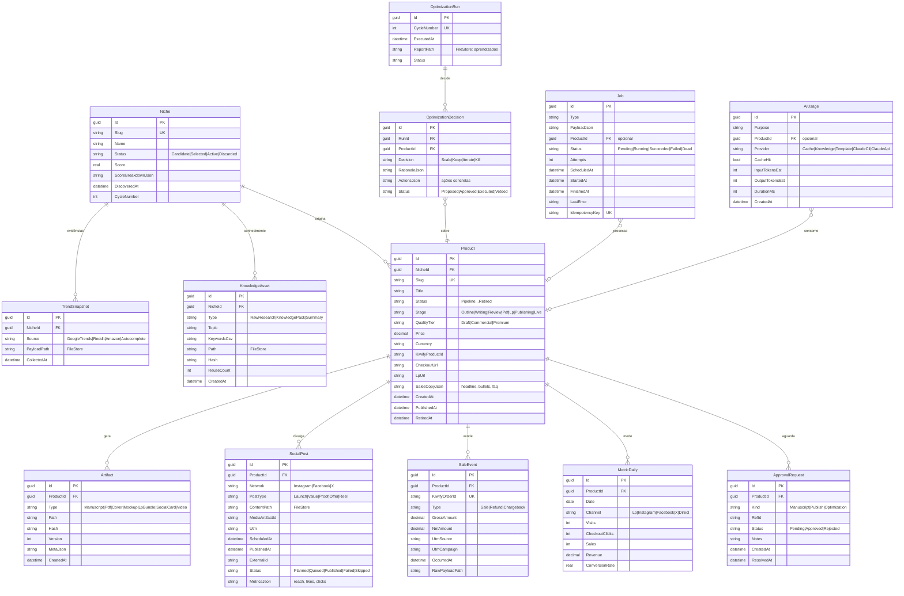

# 04 — Modelo de Dados

Filosofia: **SQLite = estado + índice + métricas agregadas. FileStore = conteúdo.**
Colunas `*Json` guardam estruturas pequenas e estáveis; conteúdo volumoso fica em arquivo referenciado por `Path` + `Hash`.

## 1. Diagrama ER



Tabelas de infraestrutura (fora do diagrama): `OutboxEvent (Id, Type, PayloadJson, CreatedAt, ProcessedAt, Error)`, `ProcessedEvent (EventId, HandlerName, ProcessedAt)` (idempotência), `Setting (Key, ValueJson, UpdatedAt)`, `User (Id, Username, PasswordHash)`, `AiCache (Hash PK, Purpose, ResponsePath, CreatedAt, HitCount)` e tabelas do Quartz (`QRTZ_*`).

## 2. Máquina de estados do Produto

```
Pipeline(Outline → Writing → Review → Pdf → Lp) → AwaitingApproval → Publishing → Live ⇄ Iterating → Retired
                                                         │ rejected ↓
                                                         Reworking ─┘
```

Transições só via métodos do agregado `Product` (DDD); cada transição emite Domain Event.

## 3. FileStore — layout e schemas JSON

```
/data/content/
├── niches/{slug}/
│   ├── trends/{source}-{yyyyMMdd}.json
│   └── knowledge/
│       ├── raw/{topic}-{hash}.json
│       └── packs/{hash}.knowledge.json
├── products/{slug}/
│   ├── manuscript/
│   │   ├── outline.json
│   │   ├── chapters/ch-{nn}.md
│   │   └── manuscript.v{n}.md
│   ├── sales-copy.json
│   └── social/calendar.json
├── ai-cache/{hash-prefix}/{hash}.json
└── cycles/cycle-{n}-report.json

/data/artifacts/
└── products/{slug}/
    ├── pdf/ebook.v{n}.pdf
    ├── images/{cover|mockup|card-*|story-*}.png
    ├── lp/ (bundle html/css/js publicado)
    └── video/reel-{n}.mp4
```

### `KnowledgePack` (insumo do Ebook Generator)
```json
{
  "niche": "string", "topic": "string", "language": "pt-BR",
  "audience": { "who": "", "pains": [""], "desires": [""], "objections": [""], "vocabulary": [""] },
  "facts": [{ "claim": "", "source": "url" }],
  "competitors": [{ "title": "", "price": 0, "angle": "" }],
  "angles": [""],
  "sources": ["url"],
  "generatedBy": "ClaudeCli|Reuse", "hash": "", "createdAt": ""
}
```

### `outline.json`
```json
{
  "title": "", "subtitle": "", "promise": "",
  "chapters": [{ "n": 1, "title": "", "goal": "", "keyPoints": [""], "targetWords": 1200 }],
  "tone": "", "qualityTier": "Commercial"
}
```

### `sales-copy.json`
```json
{
  "headline": "", "subheadline": "", "bullets": [""],
  "painSection": "", "solutionSection": "", "faq": [{ "q": "", "a": "" }],
  "price": { "anchor": 0, "current": 0 }, "bonuses": [""],
  "variants": [{ "id": "A", "headline": "", "active": true }]
}
```

### `calendar.json` (social)
```json
{
  "productSlug": "", "startDate": "", "days": 30,
  "posts": [{ "day": 1, "network": "Instagram", "postType": "Launch",
              "copy": "", "hashtags": [""], "mediaTemplate": "card-launch", "timeSlot": "19:00" }]
}
```

### `cycle-report.json` (aprendizado do ROI Optimizer)
```json
{
  "cycle": 3, "period": { "from": "", "to": "" },
  "portfolio": { "active": 12, "revenue": 0, "bestProduct": "", "worstProduct": "" },
  "decisions": [{ "product": "", "decision": "Iterate", "why": "", "actions": [""] }],
  "learnings": {
    "nicheScoreWeights": { "volume": 0.3, "competition": 0.25, "monetization": 0.3, "history": 0.15 },
    "bestPostTypes": [""], "bestPriceRange": [0, 0], "promptAdjustments": [""]
  }
}
```

## 4. Índices e pragmas

- Pragmas: `journal_mode=WAL`, `synchronous=NORMAL`, `busy_timeout=5000`, `foreign_keys=ON`.
- Índices: `Product(Status)`, `Job(Status, ScheduledAt)`, `OutboxEvent(ProcessedAt)`, `SaleEvent(ProductId, OccurredAt)`, `MetricDaily(ProductId, Date, Channel)` UNIQUE, `SocialPost(Status, ScheduledAt)`, `KnowledgeAsset(NicheId)`, `AiCache(Hash)` PK.
- Acesso: EF Core; escrita serializada por natureza do SQLite — operações longas nunca seguram transação (jobs gravam ao final).

## 5. Retenção e housekeeping (cron diário)

| Dado | Política |
|---|---|
| `OutboxEvent` processados | apagar > 30 dias |
| `Job` Succeeded | apagar > 30 dias (Dead permanece até ação manual) |
| `AiCache` | LRU: manter hits recentes; expirar sem hit > 180 dias |
| Logs JSON | rotação 14 dias |
| `TrendSnapshot` | manter 12 ciclos |
| Artefatos de produtos Retired | compactar (zip) após 60 dias |
