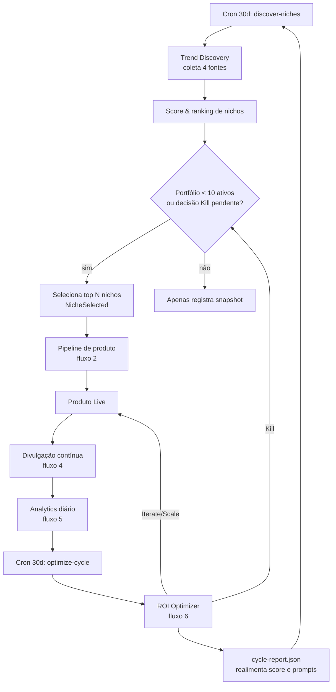
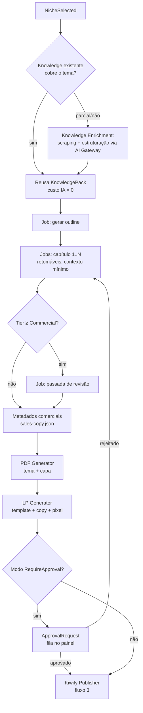
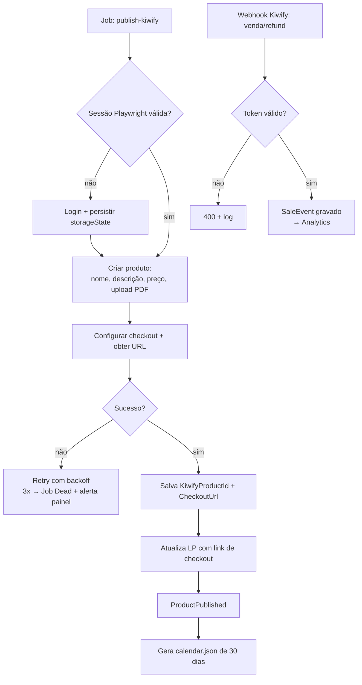
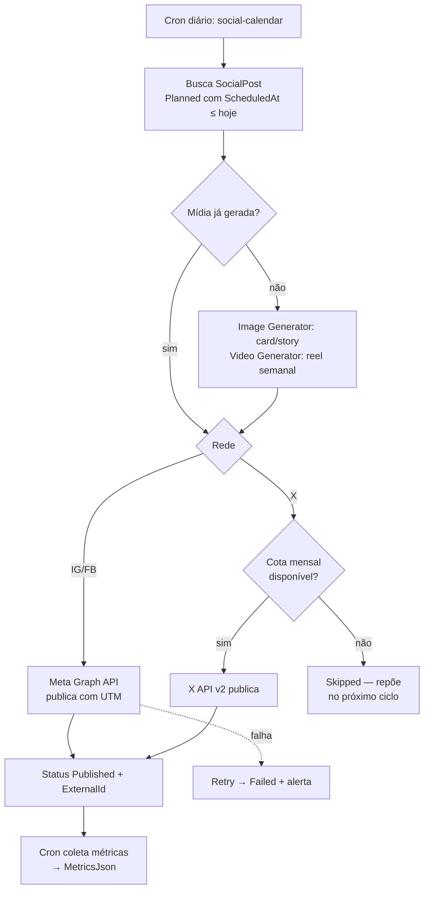
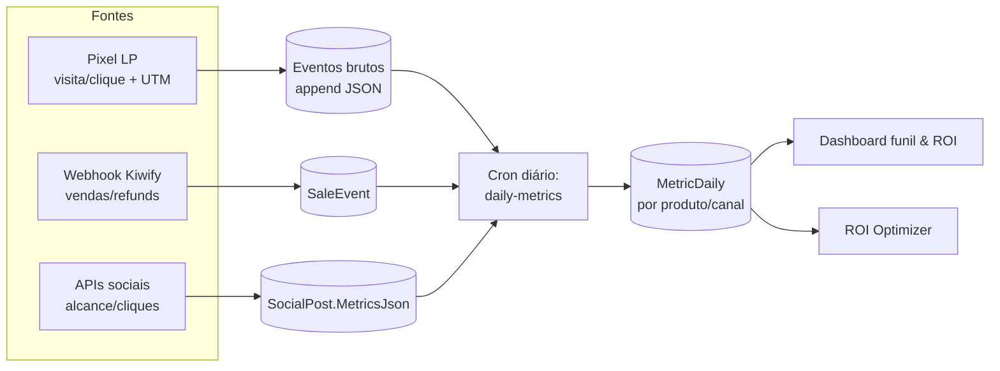
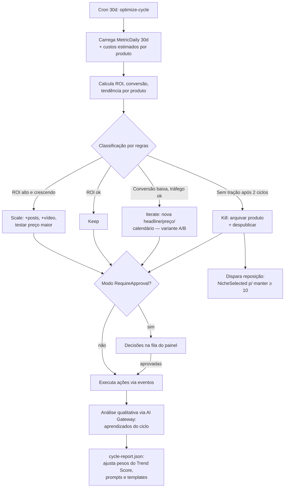
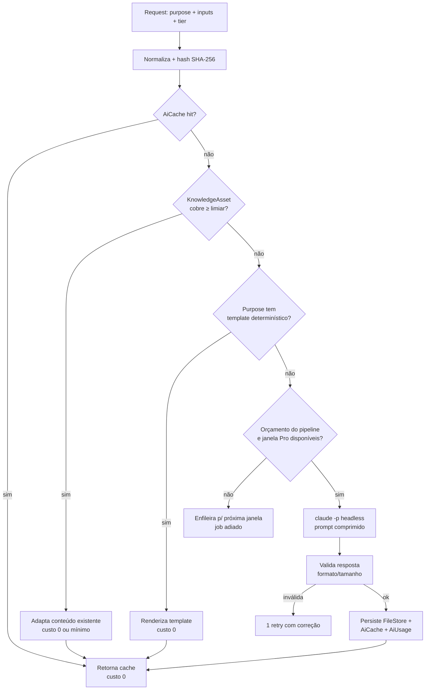
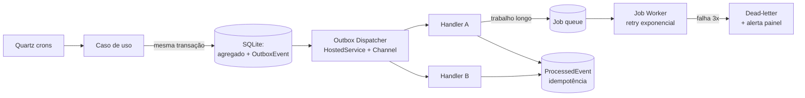

# 05 — Fluxogramas

Diagramas em Mermaid (renderizam no GitHub/VS Code).

## 1. Ciclo mestre de 30 dias

## 2. Pipeline de geração de produto

## 3. Publicação na Kiwify (Playwright)

## 4. Divulgação social (cron diário)

## 5. Analytics — funil de dados

## 6. ROI Optimizer — feedback loop

## 7. AI Gateway — decisão por requisição

## 8. Infraestrutura de eventos e jobs

